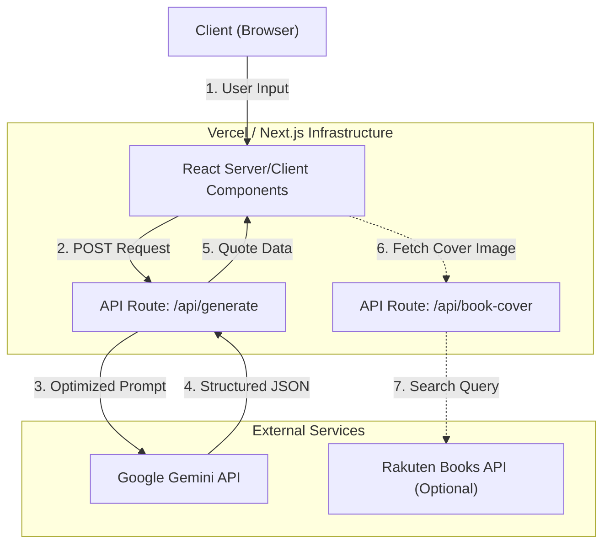
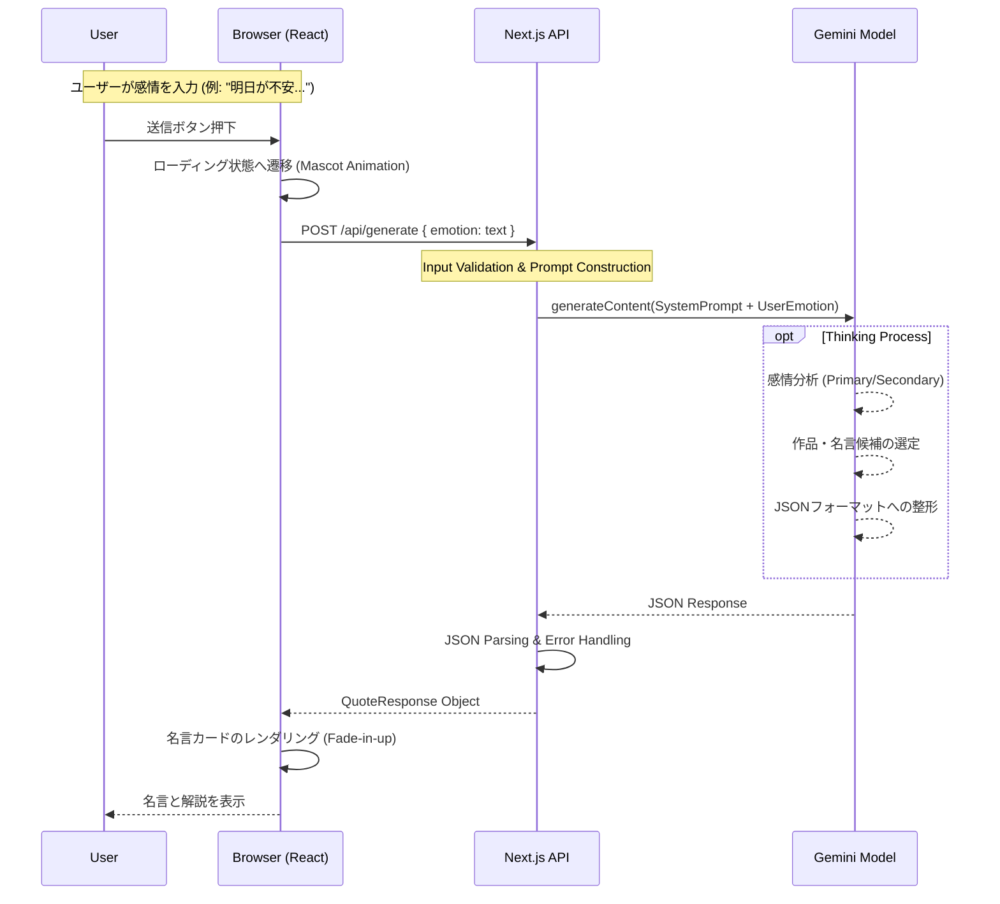

# 🌙 月ねこ名言帖 (Tsukineko Meigen-Cho) - AI Powered Quote Curator

> **「気の利いたことは言えませんが、最高の物語なら知っています。」**
>
> 感情に寄り添う、AI駆動型・和モダン名言処方アプリケーション。


<!-- ※ もしスクリーンショットがあればここに配置推奨 -->

## 📖 プロジェクト概要

**月ねこ名言帖**は、ユーザーが入力した「現在の感情」や「悩み」をAIが解析し、数多あるアニメ・漫画作品の中から**最適な「名言」**を選定して処方するWebアプリケーションです。

単なるランダム表示ではなく、Google Gemini AI のコンテキスト理解能力を活用し、ユーザーの心に響く「意外なセリフ」や「隠れた名作」を提案します。
デザインは「和モダン」をテーマに、デジタルなAI技術と伝統的な美意識（麻の葉、青海波など）を融合させています。

---

## ✨ 主な機能

1.  **AI感情分析 & 名言処方**
    *   ユーザーの自由記述（今の気持ち）を解析。
    *   「意外性」「トリビア」「検索性」を考慮したプロンプトエンジニアリングにより、深みのある選書を実現。
2.  **和モダンUI / UX**
    *   Tailwind CSS を駆使したカスタムデザイン。
    *   CSSで描画された伝統文様（麻の葉、七宝、青海波）と、和紙のテクスチャ。
    *   縦書きや明朝体を活かした、書籍のような美しいタイポグラフィ。
3.  **インタラクティブな体験**
    *   時間帯によって変化する「月ねこ」からの挨拶メッセージ。
    *   入力文字数に応じたバリデーションとUXフィードバック。
4.  **詳細な分析結果**
    *   AIがなぜその名言を選んだのか（Selection Reasoning）。
    *   検出された感情パラメータ（Primary/Secondary Emotions）の可視化。

---

## 🛠 システムアーキテクチャ

本アプリケーションは、Next.js (App Router) をベースに構築され、Vercel 上での動作を想定しています。



### アーキテクチャの特徴
*   **Edge/Serverless Functions**: バックエンドロジックは全てAPI Routeとして実装され、サーバーレスでスケールします。
*   **Prompt Engineering Layer**: `app/api/generate/route.ts` 内に、AIの「ペルソナ（伝説のオタク兼カウンセラー）」と「出力制約（JSON）」を厳密に定義しています。
*   **Type Safety**: TypeScriptによる厳格な型定義（`types/quote.ts`）により、AI出力の揺らぎを吸収し、堅牢なフロントエンド実装を保証しています。

---

## 🔄 処理シーケンス

ユーザーが感情を入力してから、名言が提示されるまでのフローです。



---

## 💻 技術スタック

| Category | Technology | Version | Usage |
| :--- | :--- | :--- | :--- |
| **Framework** | **Next.js** | 16.1.1 | App Router, Server Actions |
| **Language** | **TypeScript** | 5.x | Static Typing, Interfaces |
| **UI Library** | **React** | 19.x | Component Architecture |
| **Styling** | **Tailwind CSS** | 4.x | Utility-first CSS, Custom Animations |
| **AI Model** | **Google Gemini** | 1.5-flash | Natural Language Processing |
| **Icons** | **Lucide React** | 0.562 | SVG Icons |
| **Font** | **Google Fonts** | Noto Serif JP, Zen Kurenaido | Typography |

---

## 📂 ディレクトリ構造

```
.
├── app/
│   ├── api/generate/    # AI生成のエンドポイント
│   ├── components/      # UIコンポーネント (Atomic Design Inspired)
│   │   ├── EmotionForm.tsx   # 入力フォーム
│   │   ├── QuoteCard.tsx     # 名言表示カード
│   │   ├── WelcomeMessage.tsx # 動的ウェルカムメッセージ
│   │   └── ...
│   ├── layout.tsx       # Root Layout (Google Fonts設定)
│   └── page.tsx         # メインページ (State管理)
├── lib/
│   └── gemini.ts        # Google Generative AI クライアント初期化
├── types/
│   └── quote.ts         # APIレスポンスの型定義
└── public/              # 静的アセット (mascot.jpg 等)
```

---

## 🚀 ローカルでの実行方法

開発者向けセットアップガイドです。

### 1. 前提条件
*   Node.js (v18 or later)
*   npm or yarn or pnpm
*   Google Cloud Project での Gemini API Key 取得

### 2. インストール
リポジトリをクローンし、依存関係をインストールします。

```bash
git clone https://github.com/yourname/tsukineko-meigen-gacha.git
cd tsukineko-meigen-gacha
npm install
```

### 3. 環境変数の設定
ルートディレクトリに `.env.local` ファイルを作成し、APIキーを設定してください。

```env
GEMINI_API_KEY=your_google_gemini_api_key_here
```

### 4. 実行

```bash
npm run dev
```
`http://localhost:3000` にアクセスして動作を確認します。

---

## 🛡️ License & Credit

*   **Development**: Developed by **nekoai-lab** (Powered by Google Gemini Code Assistant)
*   **License**: MIT (See LICENSE file for details)

---
*Created with ❤️ & 🌙 by 月ねこ開発チーム*
